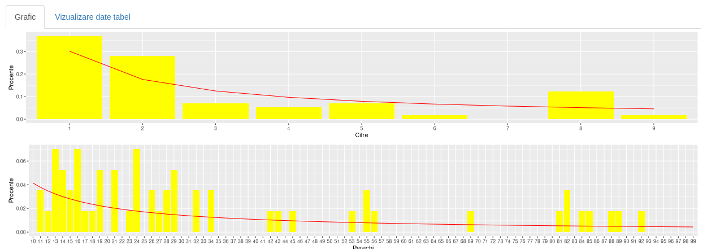
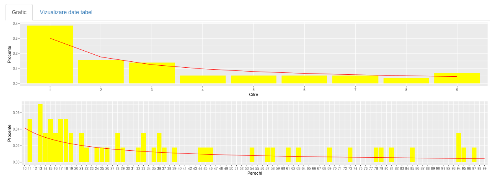
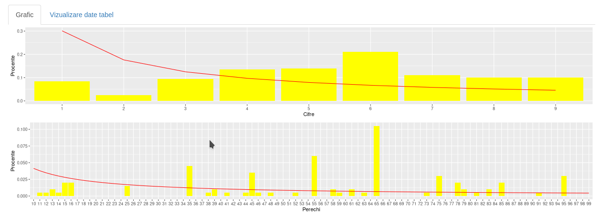
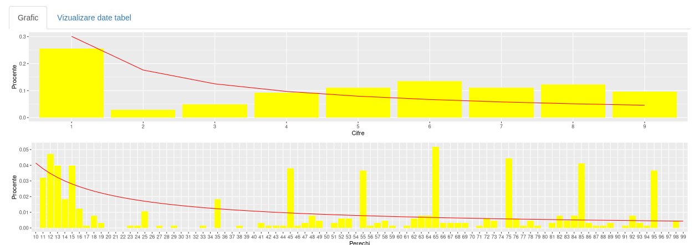
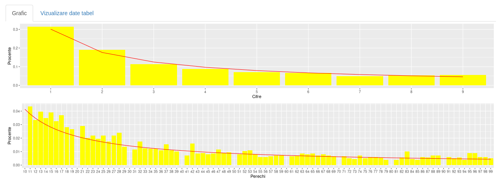
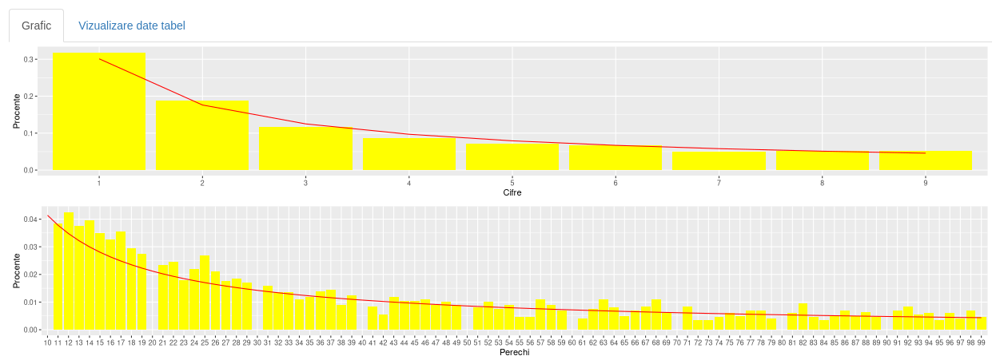
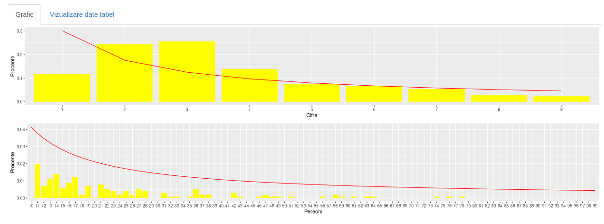
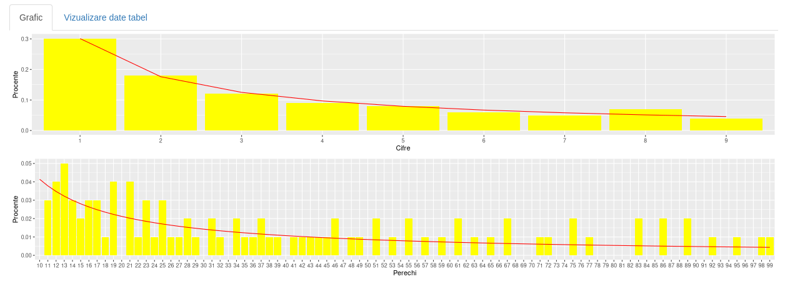

```{r setup, include=FALSE}
knitr::opts_chunk$set(echo = TRUE)
```

## Descriere

**Legea lui Benford**, numită și Legea Primei Cifre, cuprinde observații cu privire la frecvența primei cifre a unor seturi de date din realitate. Legea atestă faptul că în majoritatea colecțiilor alcătuite într-un mod natural, cifra aflată pe prima poziție are tendința să fie o cifră mai mică. În seturile care respectă această lege, s-a observat faptul că vom avea cifra 1 pe prima poziție în aproximativ 30% din cazuri, iar cifra 9 în mai puțin de 5% din cazuri. Dacă cifrele ar fi distribuite într-o manieră uniformă, fiecare dintre aceste cifre ar apărea pe prima poziție în 11,1% din cazuri. Legea lui Benford este folosită și pentru prezicerea distribuției celei de-a doua cifră, cât și pentru prezicerea unor combinații de cifre. Respectarea predicției acestei legi a fost observată atât în cazul trecerii prin toate valorile ale numărului de locuitori ai unei țări, cât și în cazul șirului lui Fibonacci și șirul puterilor lui 2.

În jurul anului 1938, fizicianul **Frank Benford** a observat faptul ca tabelele logaritmice erau mai uzate în primele pagini față de ultimele. Acesta a testat ipoteza care susținea că cifrele mai mici au o frecvență de apariție mai mare decât cifrele mai mari pe 30 de seturi de date, obținând astfel legea. Folosindu-ne de Legea lui Benford putem face o predicție cu privire la distribuția cifrelor de la 1 la 9 la nivelul unui set de date. Probabilitatea apariției este generata astfel de această formulă:

$P(D = d)=lg(1+\frac{1}{d})\ , unde \ d\in\{1..9\}$\

Tot cu legea lui Benford se poate calcula și probabilitatea apariției primelor 2 cifre sub un anumit format:

$P(D = d)=lg(1+\frac{1}{d})\ , unde \ d\in\{10..99\}$\

## Prezentarea Aplicației - Descrierea Tabelelor

Aplicația noastră ilustrează corectitudinea Legii lui Benford pe **cinci seturi de date**. Pe trei dintre acestea ilustrăm aplicabilitatea legii atât pentru o cifră, cât și pentru primele două cifre, iar pe celalalte arătăm diferențele dintre curba lui Benford pentru cele două formule de mai sus, cât și felul eronat în care se contruiesc graficele din datele incorecte.

  1. [Nașteri și decese SUA](#unu) \
  2. [Pokemon](#doi) \
  3. [Populația SUA](#trei) \
  4. [Nume de câini](#patru) \
  5. [Șirul lui Fibonacci](#cinci) \
  
### Nașteri și decese SUA ^[https://www2.census.gov/programs-surveys/popest/datasets/] {#unu}

**Primul set de date** cuprinde informații despre numărul de morți și numărul de născuți din anii 2020 și 2021 din SUA. Am ales acest set de date observând faptul că datele din acest tabel nu respectă condițiile Legii lui Benford. Interfața realizată prin intermediul pachetului Shiny permite utilizatorului să selecteze una dintre cele 4 opțiuni: Nașteri 2020, Nașteri 2021, Morți 2020, Morți 2021 și va afișa pentru opțiunea selectată atât graficul obținut prin calcularea procentului de frecvență al unei cifre alături de curba lui Benford, cât și graficul pentru procentul de frecvență al primelor două cifre, cât și curba generată în cazul respectării Legii lui Benford. Aceste date au dus la obținerea unor grafice precum următoarele:

#### Nașteri 2020



#### Morți 2020



### Pokemon ^[https://www.kaggle.com/abcsds/pokemon] {#doi}

**Al doilea set de date** cuprinde informații despre Pokemoni. Am ales acest set de date observând faptul că datele din acest tabel nu respectă condițiile Legii lui Benford. Interfața permite utilizatorului să selecteze una dintre cele 4 opțiuni: HP, Atac, Apărare, Viteză și va afișa pentru opțiunea selectată atât graficul obținut prin calcularea procentului de frecvență al unei cifre alături de curba lui Benford, cât și graficul pentru procentul de frecvență al primelor două cifre, cât și curba generată în cazul respectării Legii lui Benford. Aceste date au dus la obținerea unor grafice precum următoarele:

#### HP



#### Atac



### Populatia SUA ^[https://www2.census.gov/programs-surveys/popest/datasets/] {#trei}

**Al treilea set de date** cuprinde informații despre populația din SUA. Am ales acest set de date observând faptul că datele din acest tabel respectă condițiile Legii lui Benford --- datele sunt mari și predispuse creșterii exponențiale. Interfața permite utilizatorului să selecteze una dintre cele 10 opțiuni: populația în oricare din anii 2010--2019 și va afișa pentru opțiunea selectată atât graficul obținut prin calcularea procentului de frecvență al unei cifre alături de curba lui Benford, cât și graficul pentru procentul de frecvență al primelor două cifre, cât și curba generată în cazul respectării Legii lui Benford. Aceste date au dus la obținerea unor grafice precum următoarele:

#### Populația din 2010



#### Populația din 2015



### Nume de câini ^[https://www.kaggle.com/yamqwe/dog-names-over-timee] {#patru}

**Al patrulea set de date** cuprinde informații despre nume de câini. Am ales acest set de date observând faptul ca datele din acest tabel nu respectă condițiile Legii lui Benford. Interfața permite utilizatorului să afișeze pentru numărul de câini având un nume dat atât graficul obținut prin calcularea procentului de frecvență al unei cifre alături de curba lui Benford, cât și graficul pentru procentul de frecvență al primelor două cifre, cât și curbă generată în cazul respectării Legii lui Benford. Aceste date au dus la obținerea următorului grafic:



### Șirul lui Fibonacci ^[https://www.kaggle.com/brandonconrady/fibonacci-sequence-first-10001-numbers]

**Al treilea set de date** cuprinde informații despre populația din SUA. Am ales acest set de date observând faptul că datele din acest tabel respectă condițiile Legii lui Benford. Interfața permite utilizatorului să afișeze pentru numerele din șirul lui Fibonacci atât graficul obținut prin calcularea procentului de frecvență al unei cifre alături de curba lui Benford, cât și graficul pentru procentul de frecvență al primelor două cifre, cât și curba generată în cazul respectării Legii lui Benford. Aceste date au dus la obținerea următorului grafic:



## Prezentarea Aplicației - Implementare

Pentru implementarea aplicației noastre am folosit următoarele pachete din R:

- `library("shiny")`
- `library("ggplot2")`
- `library("plot.matrix")`
- `library("ggpubr")`

Respectând structura unei aplicații Shiny, codul nostru este împărțit în 3 mari componente:

  1. [Interfața Utilizatorului (UI)](#ui) \
  2. [Server](#srv) \
  3. [ShinyApp](#shiny) \

### Interfața Utilizatorului (UI): {#ui}

Am folosit `titlePanel` și `helpText` pentru a adăuga un titlu și un subtitlu paginii, apoi `navbarPage()` pentru a crea câte o pagină separată (`tabPanel`) pentru fiecare experiment. Fiecare `tabPanel` este sub formă de `sidebarLayout`, unde `sidebarPanel` conține controalele de input. Utilizatorul poate selecta coloana din tabel pentru care să aplice Legea lui Benford prin bifarea `radioButton`-ului corespunzător. Printr-un `sliderInput`, utilizatorul poate selecta scara la care să fie efectuat raportul. 

Output-ul se face prin intermediul `mainPanel`-ului, unde am utilizat `tabsetPanel` pentru a crea două sub-pagini (`tabPanel`-uri) pentru a vizualiza fie graficele corespunzătoare input-ului selectat de utilizator, fie tabelul din care sunt extrase date pentru experimentul respectiv. Graficele sunt afișate cu ajutorul `plotOutput()`, iar tabelele prin `DT::dataTableOutput()` din folder-ul proiectului.

```R
ui <- fluidPage(
  tags$head(
    tags$link(rel = "stylesheet", type = "text/css", href = "styles.css")
  ),
  titlePanel("Legea lui Benford"),
  helpText(
    "Proiect realizat de Marton Alexandru-Sergiu, Gherghescu Andreea Diana, Broscoteanu Daria-Mihaela — Grupa 243"
  ),
  navbarPage(
    "Meniu",
    tabPanel(
      "Introducere",
      tags$h2("Legea lui Benford"),
      tags$p(
        paste("Legea lui Benford, numită și Legea Primei Cifre, cuprinde ",
              "observații cu privire la frecvența primei cifre a unor seturi ",
              "de date din realitate. Legea atestă faptul că în majoritatea ",
              "colecțiilor alcătuite într-un mod natural, cifra aflată pe ",
              "prima poziție are tendința să fie o cifră mai mică. În seturile ",
              "care respectă această lege, s-a observat faptul că vom avea ",
              "cifra 1 pe prima poziție în aproximativ 30% din cazuri, iar ",
              "cifra 9 în mai puțin de 5% din cazuri. Dacă cifrele ar fi ",
              "distribuite într-o manieră uniformă, fiecare dintre aceste ",
              "cifre ar apărea pe prima poziție în 11,1% din cazuri. Legea ",
              "lui Benford este folosită și pentru prezicerea distribuției ",
              "celei de-a doua cifră, cât și pentru prezicerea unor ",
              "combinații de cifre. Respectarea predicției acestei legi a ",
              "fost observată atât în cazul trecerii prin toate valorile ale ",
              "numărului de locuitori ai unei țări, cât și în cazul șirului ",
              "lui Fibonacci și șirul puterilor lui 2.")
      ),
      tags$p(
        paste(
          "În jurul anului 1938, fizicianul Frank Benford a observat faptul ",
          "ca tabelele logaritmice erau mai uzate în primele pagini față de ",
          "ultimele. Acesta a testat ipoteza care susținea că cifrele mai mici ",
          "au o frecvență de apariție mai mare decât cifrele mai mari pe 30 de ",
          "seturi de date, obținând astfel legea. Folosindu-ne de Legea lui ",
          "Benford putem face o predicție cu privire la distribuția cifrelor ",
          "de la 1 la 9 la nivelul unui set de date. Probabilitatea apariției ",
          "este generata astfel de această formulă:"
        )
      ),
      withMathJax(
        tags$p("$$P(D = d)=lg(1+\\frac{1}{d})\\ , unde \\ d\\in\\{1..9\\}$$")
      )
    ),
    tabPanel("Populația SUA",
             sidebarLayout(
               sidebarPanel(
                 radioButtons(
                   "column1",
                   "Alege domeniu:",
                   choiceNames = sapply(2010:2019, function(x) { paste("Populație", x) }),
                   choiceValues = sapply(2010:2019, function(x) { paste("POPESTIMATE", x, sep="") })
                 ),
                 sliderInput(
                   "n1",
                   "Mărime de referință",
                   min = 0,
                   max = 3193,
                   value = 2000
                 ),
                 
                 hr(),
                 helpText("Sursă date:"),
                 tags$a(href = "https://www2.census.gov/programs-surveys/popest/datasets/", "US Census Bureau")
               ),
               mainPanel(tabsetPanel(
                 tabPanel("Grafic", plotOutput("date1")),
                 tabPanel("Vizualizare date tabel", DT::dataTableOutput("mytable1"))
               ))
             )),
    tabPanel(
      "Nașteri și decese din SUA 2020–2021",
      sidebarLayout(
        sidebarPanel(
          radioButtons(
            "column2",
            "Alege domeniu:",
            choiceNames = c('Nașteri 2020', 'Nașteri 2021', 'Morți 2020', 'Morți 2021'),
            choiceValues = c('BIRTHS2020', 'BIRTHS2021', 'DEATHS2020', 'DEATHS2021')
          ),
          sliderInput(
            "n2",
            "Mărime de referință",
            min = 0,
            max = 57,
            value = 20
          ),
          hr(),
          helpText("Sursă date:"),
          tags$a(href = "https://www.kaggle.com/datasnaek/youtube-new?select=CAvideos.csv", "Kaggle.com-Trending YouTube Video Statistics (2019)")
        ),
        mainPanel(tabsetPanel(
          tabPanel("Grafic", plotOutput("date2")),
          tabPanel("Vizualizare date tabel", DT::dataTableOutput("mytable2"))
        ))
      )
    ),
    tabPanel("Pokemon",
             sidebarLayout(
               sidebarPanel(
                 radioButtons(
                   "column3",
                   "Alege domeniu:",
                   choiceNames = c('HP', 'Atac', 'Apărare', 'Viteză'),
                   choiceValues = c('HP', 'Attack', 'Defense', 'Speed')
                 ),
                 sliderInput(
                   "n3",
                   "Mărime de referință",
                   min = 0,
                   max = 799,
                   value = 200
                 ),
                 hr(),
                 helpText("Sursă date:"),
                 tags$a(href = "https://www.kaggle.com/abcsds/pokemon", "kaggle - Pokemon with stats")
               ),
               mainPanel(tabsetPanel(
                 tabPanel("Grafic", plotOutput("date3")),
                 tabPanel("Vizualizare date tabel", DT::dataTableOutput("mytable3"))
               ))
             )),
    tabPanel("Nume de câini",
             sidebarLayout(
               sidebarPanel(
                 radioButtons(
                   "column4",
                   "Alege domeniu:",
                   choiceNames = c('Număr apariții'),
                   choiceValues = c('Count')
                 ),
                 sliderInput(
                   "n4",
                   "Mărime de referință",
                   min = 0,
                   max = 16000,
                   value = 1000
                 ),
                 
                 hr(),
                 helpText("Sursă date:"),
                 tags$a(href = "https://www.kaggle.com/yamqwe/dog-names-over-timee", "kaggle - Dog Names over Time")
               ),
               mainPanel(tabsetPanel(
                 tabPanel("Grafic", plotOutput("date4")),
                 tabPanel("Vizualizare date tabel", DT::dataTableOutput("mytable4"))
               ))
             )),
    tabPanel(
      "Secvența Fibonacci",
      sidebarLayout(
        sidebarPanel(
          radioButtons(
            "column5",
            "Alege domeniu:",
            choiceNames = c("Valoare"),
            choiceValues = c("Value")
          ),
          sliderInput(
            "n5",
            "Mărime de referință",
            min = 0,
            max = 1477,
            value = 100
          ),
          hr(),
          helpText("Sursă date:"),
          tags$a(href = "https://www.kaggle.com/brandonconrady/fibonacci-sequence-first-10001-numbers", "kaggle - Fibonacci Sequence")
        ),
        mainPanel(tabsetPanel(
          tabPanel("Grafic", plotOutput("date5")),
          tabPanel("Vizualizare date tabel", DT::dataTableOutput("mytable5"))
        ))
      )
    )
  )
)
```

### Server: {#srv}

Implementarea funcției `Benfords_law`:

Pentru a putea calcula Legea lui Benford pentru seturile de date primite ca parametrii, vom avea nevoie de două funcții care să ne extragă prima cifră, respectiv a doua cifră:

```R
firstDigit <- function(element) {
  element <- gsub('[0.]', '', element)
  as.numeric(substr(element, 1, 1))
}

secondDigit <- function(element) {
  element <- gsub('[0.]', '', element)
  as.numeric(substr(element, 2, 2))
}
```

Parcurgem setul de date primite ca parametru, iar pentru fiecare dintre acestea ne vom folosi de funcțiile definite mai sus pentru a determina primele două cifre. După care, vom incrementa în vectorul de frecvențe (pentru prima cifră) numărul de apariții ale acesteia, iar pentru perechile (prima cifră, a doua cifră) vom incrementa în matricea de frecvențe în `matrice[prima cifră, a doua cifră]`:

```R
for (i in 1:number_of_lines) {
  first_digit <- firstDigit(rate[i])
  second_digit <- secondDigit(rate[i])
  frequencies[first_digit] <- frequencies[first_digit] + 1
  frequencies2[first_digit, second_digit + 1] <-
    frequencies2[first_digit, second_digit + 1] + 1
  total_frequencies2 <- total_frequencies2 + 1
  total_frequencies <- total_frequencies + 1
}
```

Pentru fiecare cifră, respectiv pereche de cifre vom calcula procentul cu frecvența cu care acesta se repetă în datele primite:

```R
for (i in 1:9) {
  # For only 1 digit
  procents[i] <- frequencies[i] / total_frequencies
  
  # For 2 digits
  for (j in 1:10) {
    procents2[i, j] <- frequencies2[i, j] / total_frequencies2
  }
}
```

După care vom calcula valoarea corectă a Legii lui Benford pentru cifra/cifrele respectivă/respective:

```R
for (i in 1:9) {
  # For only 1 digit
  benford[i] <- log10(1 + 1 / i)
  
  # For 2 digits
  for (j in 1:10) {
    benford2[i, j] = log10(1 + 1 / (i * 10 + (j - 1)))
  }
}
```

Pentru a afișa graficele, ne vom crea mai întâi câte un frame care va conține cifrele sau numerele aflate pe axa Ox, procentele pentru aceste numere, și tabloul cu rezultatele corecte ale Legii lui Benford.

```R
frame3 <- data.frame(
  Cifre = c("1", "2", "3", "4", "5", "6", "7", "8", "9"),
  ben = benford,
  Procente = procents
)

numbers <- c()
for (i in 1:9) {
  for (j in 1:10) {
    x <- as.character(i)
    y <- as.character(j - 1)
    val <- paste(x, y, sep = "")
    numbers <- append(numbers, val)
  }
}

frame4 <- data.frame(Perechi = numbers,
                     ben2 = c(t(benford2)),
                     Procente = c(t(procents2)))
```

Pentru generarea graficelor, ne vom crea două `ggplot`-uri, `p1` și `p2`, care vor afișa atât `geom_bar`-urile pentru valorile din vectorul de procente, cât și curba lui Benford, pentru a putea evidenția rezultatul acesteia. Afișarea celor două plot-uri unul sub celălalt este permisă prin folosirea a `ggarrange`.

```R
p1 <-
  ggplot(data = frame3, aes(x = Cifre, group = 1)) + geom_bar(aes(y = Procente),
                                                               stat = "identity",
                                                               color = NA,
                                                               fill = "yellow") + geom_line(aes(y = ben), stat = "identity", color = "red")
p2 <-
  ggplot(data = frame4, aes(x = Perechi, group = 1)) + geom_bar(
    aes(y = Procente),
    stat = "identity",
    color = NA,
    fill = "yellow"
  ) + geom_line(aes(y = ben2), stat = "identity", color = "red")
ggarrange(p1, p2, nrow = 2)
```

Prin funcția `read.csv()` citim în variabila `data` datele din fișierele de tip CSV. Pentru a afișa tabelele folosim `renderDataTable()`. În funcție de numele coloanei selectată de utilizator, variabila `rate` va reține datele respective, extrase din `data`. În variabila `rows` vom avea scara selectată de utilizator, apoi aplicăm funcția `Benfords_law`, având ca parametri datele coloanei pe care se aplică și scara la care se aplică.

```R
renderDataset <- function(index, csvFile) {
  output[[paste("date", index, sep="")]] <- renderPlot({
    data <- read.csv(csvFile, header = TRUE)
    output[[paste("mytable", index, sep="")]] <- DT::renderDataTable(data)
    
    rate <- data[[input[[paste("column", index, sep="")]]]]
    rows <- input[[paste("n", index, sep="")]]
    
    Benfords_law(rate, rows)
  })
}

renderDataset(1, "USpopulation.csv")
renderDataset(2, "DB.csv")
renderDataset(3, "Pokemon.csv")
renderDataset(4, "DogsName.csv")
renderDataset(5, "fibonacci_sequence.csv")
```

### ShinyApp: {#shiny}

Pentru a putea rula aplicația noastră, avem nevoie de următoarea instrucțiune:

```R
shinyApp(ui = ui, server = server)
```

