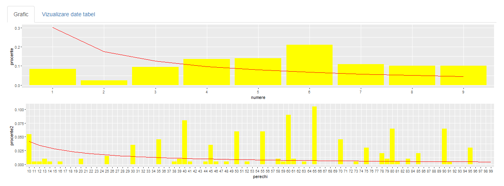
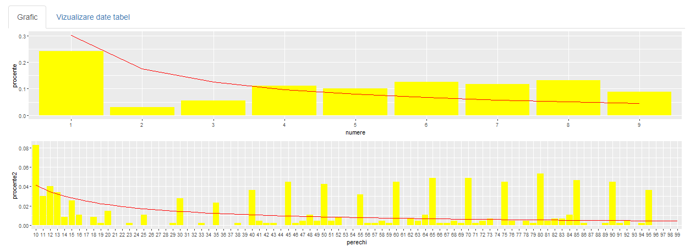
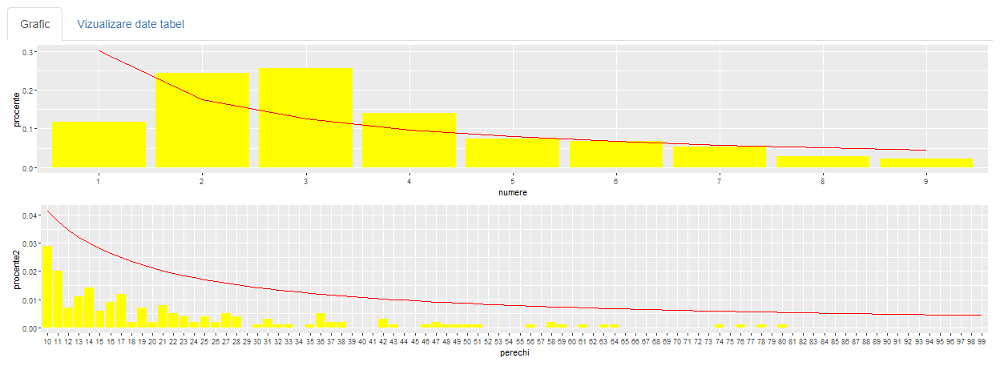

```{r setup, include=FALSE}
knitr::opts_chunk$set(echo = TRUE)
```

## Descriere
**Legea Lui Benford**, numită și Legea Primei Cifre, cuprinde observații cu privire la frecvența primei cifre a unor seturi de date din realitate. Legea atestă faptul că în majoritatea colecțiilor alcătuite într-un mod natural, cifra aflată pe prima poziție are tendința să fie o cifră mai mică. În seturile care respectă această lege, s-a observat faptul că vom avea cifra 1 pe prima poziție în aproximativ 30% din cazuri, iar cifra 9 în mai puțin de 5% din cazuri. Dacă cifrele ar fi distribuite într-o manieră uniformă, fiecare dintre aceste cifre ar apărea pe prima poziție în 11,1% din cazuri. Legea lui Benford este folosită și pentru prezicerea distribuției celei de-a doua cifră, cât și pentru prezicerea unor combinații de cifre. Respectarea predicției acestei legi a fost observată atât în cazul trecerii prin toate valorile ale numărului de locuitori ai unei țări, cât și în cazul șirului lui Fibonacci și șirul puterilor lui 2.

În jurul anului 1938, fizicianul **Frank Benford** a observat faptul ca tabelele logaritmice erau mai uzate în primele pagini față de ultimele. Acesta a testat ipoteza care susținea că cifrele mai mici au o frecvență de apariție mai mare decât cifrele mai mari pe 30 de seturi de date, obținând astfel legea. Folosindu-ne de Legea lui Benford putem face o predicție cu privire la distribuția cifrelor de la 1 la 9 la nivelul unui set de date. Probabilitatea apariției este generata astfel de această formulă:

$P(D = d)=lg(1+\frac{1}{d})\ , unde \ d\in\{1..9\}$\

Tot cu legea lui Benford se poate calcula și probabilitatea apariției primelor 2 cifre sub un anumit format:

$P(D = d)=lg(1+\frac{1}{d})\ , unde \ d\in\{10..99\}$\

## Prezentarea Aplicatiei - Descrierea Tabelelor

Aplicatia noastra ilustreaza corectitudinea Legii Lui Benford pe **cinci seturi de date**. Pe doua dintre acestea ilustram aplicabilitatea legii atat pentru o cifra, cat si pentru primele doua cifre, iar pe celalalte aratam diferentele dintre curba lui benford pentru cele doua formule de mai sus, cat si felul eronat in care se contruiesc graficele din datele incorecte. Toate seturile noastre de date sunt procurate de pe site-ul: https://www.kaggle.com/.

  1. [Nasteri si decese SUA](#unu) \
  2. [Pokemon](#doi) \
  3. [Populatia SUA](#trei) \
  4. [Nume de caini](#patru)\
  
### Nasteri si decese SUA: {#unu}

**Primul set de date** cuprinde informatii despre Numarul de morti si Numarul de nascuti din anii 2020 si 2021 din SUA. Am ales acest set de date observand faptul ca datele din acest tabel nu respecta conditiile Legii lui Benford. Interfata realizata prin intermediul pachetului shiny permite utilizatorului sa selecteze una dintre cele 4 optiuni: Nasteri 2020, Nasteri 2021, Morti 2020, Morti 2021 si va afisa pentru optiunea selectata atat graficul obtinut prin calcularea procentului de frecventa al unei cifre alaturi de curba lui Benford, cat si graficul pentru procentul de frecventa al primelor doua cifre, cat si curba generata in cazul respectarii Legii lui Benford. Aceste date au dus la obtinerea urmatoarelor grafice:

## de pus grafice pentru setul 1

### Pokemon: {#doi}

**Al doilea set de date** cuprinde informatii despre Pokemoni. Am ales acest set de date observand faptul ca datele din acest tabel nu respecta conditiile Legii lui Benford. Interfata realizata prin intermediul pachetului shiny permite utilizatorului sa selecteze una dintre cele 4 optiuni: HP, Atac, Aparare, Viteza si va afisa pentru optiunea selectata atat graficul obtinut prin calcularea procentului de frecventa al unei cifre alaturi de curba lui Benford, cat si graficul pentru procentul de frecventa al primelor doua cifre, cat si curba generata in cazul respectarii Legii lui Benford. Aceste date au dus la obtinerea urmatoarelor grafice:

**HP**

**Atac**


### Populatia SUA: {#trei}

**Al treilea set de date** cuprinde informatii despre Populatia din SUA. Am ales acest set de date observand faptul ca datele din acest tabel respecta conditiile Legii lui Benford - datele sunt mari si predispuse cresterii exponentiale. Interfata realizata prin intermediul pachetului shiny permite utilizatorului sa selecteze una dintre cele 10 optiuni: Populatia in oricare din anii 2010 - 2019 si va afisa pentru optiunea selectata atat graficul obtinut prin calcularea procentului de frecventa al unei cifre alaturi de curba lui Benford, cat si graficul pentru procentul de frecventa al primelor doua cifre, cat si curba generata in cazul respectarii Legii lui Benford. Aceste date au dus la obtinerea urmatoarelor grafice:

## de pus cateva exemple - nu toate ca murim 

### Nume de caini: {#patru}

**Al patrulea set de date** cuprinde informatii despre nume de caini. Am ales acest set de date observand faptul ca datele din acest tabel nu respecta conditiile Legii lui Benford. Interfata realizata prin intermediul pachetului shiny permite utilizatorului sa  afiseze pentru numarul de caini avand un nume dat atat graficul obtinut prin calcularea procentului de frecventa al unei cifre alaturi de curba lui Benford, cat si graficul pentru procentul de frecventa al primelor doua cifre, cat si curba generata in cazul respectarii Legii lui Benford. Aceste date au dus la obtinerea urmatoarelor grafice:


```{r cars}
summary(cars)
```

## Prezentarea Aplicatiei - Implementare

Pentru implementarea aplicatiei noastre am folosit urmatoarele pachete din R:

- library(shiny)

- library(ggplot2)

- library('plot.matrix')

- library(ggpubr)

Respectand structura unei aplicatii shiny, codul nostru este impartit in 3 mari componente:

  1. [Interfata Userului(UI)](#ui) \
  2. [Server](#srv) \
  3. [ShinyApp](#shiny) \


### Interfata Userului(UI): {#ui}

Am folosit **titlePanel** si **helpText** pentru a adauga un titlu si un subtitlu paginii, apoi **navbarPage()** pentru a crea cate o pagina separata(tabPanel) pentru fiecare experiment. Fiecare tabPanel este sub forma de **sidebarLayout**, **unde sidebarPanel** contine controalele de input. Utilizatorul poate selecta coloana din tabel pentru care sa aplice legea lui Benford prin bifarea **radioButton-ului** corespunzator.  Printr-un **sliderInput**, utilizatorul poate selecta scara la care sa fie efectuat raportul. 

Output-ul se face prin intermediul **mainPanel-ului**, unde am utilizat tabsetPanel pentru a crea doua sub-pagini **(tabPanel-uri)** pentru a vizualiza fie graficele corespunzatoare input-ului selectat de utilizator, fie tabelul din care sunt extrase date pentru experimentul respectiv. Graficele sunt afisate cu ajutorul **plotOutput()**, iar tabelele prin **DT::dataTableOutput()** din folder-ul proiectului.

## de pus cod


### Server(UI): {#srv}


Implementarea functiei Benford:

Pentru a putea calcula Legea lui Benford pentru seturile de date primite ca parametrii, vom avea nevoie de doua functii care sa ne extraga prima cifra, respectiv a doua cifra:

```
firstDigit <- function(element){
      element = gsub('[0.]', '', element)
       as.numeric(substr(element, 1, 1))
    }
    
    secondDigit <- function(element){
      element2 = gsub('[0.]', '', element)
       as.numeric(substr(element, 2, 2))
    }
    
```

Parcurgem setul de date primite ca parametru, iar pentru fiecare dintre acestea ne vom folosi de functiile definite mai sus pentru a determina primele doua cifre. Dupa care, vom incrementa in vectorul de frecvente (pentru prima cifra) numarul de aparitii ale acesteia, iar pentru perechile (prima cifra, a doua cifra) vom incrementa in matricea de frecvente in matrice[prima cifra, a doua cifra]:

```
 for (i in 1: number_of_lines){
      first_digit = firstDigit(rate[i])
      second_digit = secondDigit(rate[i])
      frequencies[first_digit] <- frequencies[first_digit] + 1
      frequencies2[first_digit, second_digit + 1] <- frequencies2[first_digit, second_digit + 1] + 1
      total_frequencies2 <- total_frequencies2 + 1
      total_frequencies <- total_frequencies + 1
    }
```

Pentru fiecare cifra, respectiv pereche de cifre vom calcula procentul cu frecventa cu care acesta se repeta in datele primite:
```
for (i in 1:9){
      # For only 1 digit
      procents[i] <- frequencies[i]/total_frequencies
      
      # For 2 digits
      for (j in 1:10){
        procents2[i,j] = frequencies2[i,j]/total_frequencies2
      }
    }
```

Dupa care vom calcula valoarea corecta a Legii lui Benford pentru cifra/cifrele respectiva/respective:

```
for (i in 1:9){
      # For only 1 digit
      benford[i] <- log10(1 + 1/i)
      
      # For 2 digits
      for(j in 1:10){
        benford2[i,j] = log10(1 + 1/(i * 10 + (j - 1)))
      }
    }
```

Pentru a afisa graficele, ne vom crea mai intai cate un frame care va contine cifrele sau numerele aflate pe axa Ox, procentele pentru aceste numere, si tabloul cu rezultatele corecte ale Legii lui Benford.

```
    frame3<-data.frame(
      numere=c("1","2", "3", "4", "5", "6", "7", "8", "9"),
      ben=benford,
      procente=procents
    )
    
    numbers <- c()
    for (i in 1:9){
      for(j in 1:10){
        x <- as.character(i)
        y <- as.character(j - 1)
        val <- paste(x, y, sep="")
        numbers <- append(numbers, val)
      }
    }
    frame4 <- data.frame(
      perechi=numbers,
      ben2=c(t(benford2)),
      procente2=c(t(procents2))
    )
```

Pentru generarea graficelor, ne vom crea doua ggplot-uri, p1 si p2, care vor afisa atat geom_bar-urile pentru valorile din vectorul de procente, cat si curba lui Benford, pentru a putea evidentia rezultatul acesteia. Afisarea celor doua plot-uri unul sub celalalt este permisa prin folosirea a ggarrange.

```
p1 <- ggplot(data = frame3, aes(x = numere, group = 1))+ geom_bar(aes(y = procente), stat = "identity", color=NA, fill="yellow") + geom_line(aes(y = ben), stat = "identity", color="red")
    p2 <- ggplot(data = frame4, aes(x = perechi, group = 1))+ geom_bar(aes(y = procente2), stat = "identity", color=NA, fill="yellow") + geom_line(aes(y = ben2), stat = "identity", color="red")
    ggarrange(p1, p2, nrow = 2)
    
```


Prin functia **read.csv()** citim in variabila datax datele din fisierele de tip CSV. Pentru a afisa tabelele folosim **renderDataTable()**. In variabila nume_coloana extragem din input coloana selectata de utilizator pentru a aplica legea lui Benford pe datele acesteia. In functie de numele coloanei, variabila rate va retine datele respective, extrase din datax. In variabila linii_coloana vom avea scara selectata de utilizator, apoi aplicam functia Benfords_law, avand ca parametri datele coloanei pe care se aplica si scara la care se aplica.

```
output$date3 <- renderPlot({
    data3<-(read.csv("Pokemon.csv", header=TRUE))
    
    output$mytable3 = DT::renderDataTable(data3)
    
    nume_coloana<-input$column3
    if (nume_coloana == 'HP')
      rate<-data3$HP
    else if (nume_coloana == 'Attack')
      rate<-data3$Attack
    else if (nume_coloana == 'Defense')
      rate<-data3$Defense
    else
      rate<-data3$Speed
    
    linii_coloana<-input$n3
    
    Benfords_law(rate, linii_coloana)
  })
```
### ShinyApp: {#shiny}

Pentru a putea rula aplicatia noastra, avem nevoie de urmatoarea instructiune:

```
shinyApp(ui = ui, server = server)
```

